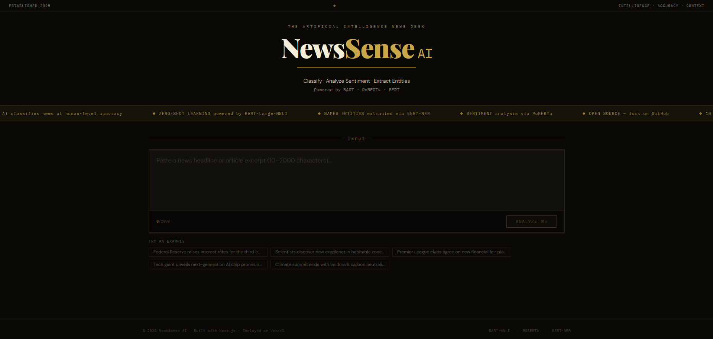
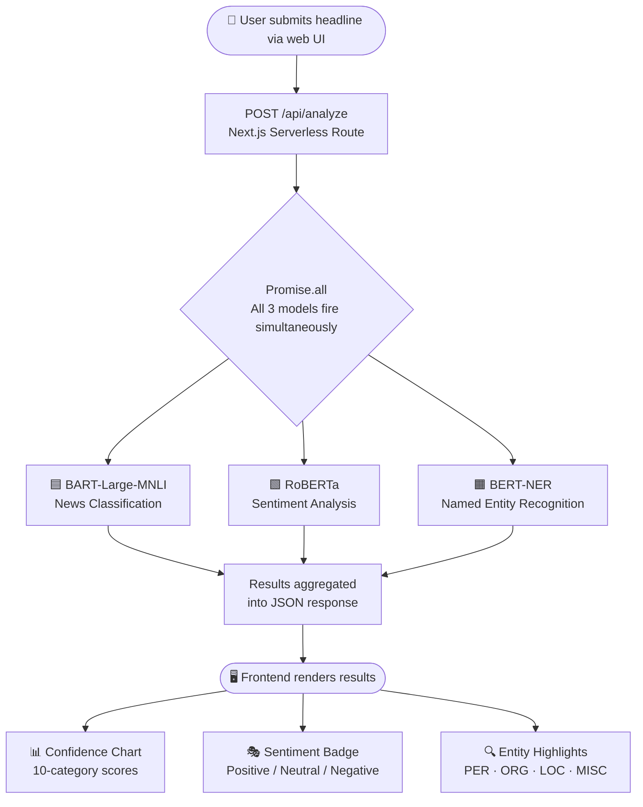

<div align="center"> 

# 📰 NewsSense AI

**A full-stack NLP web app that classifies any news headline into 10 categories, detects sentiment and extracts named entities in ~2–3 seconds powered by three HuggingFace transformer models running in parallel, built with Next.js 14 and deployed on Vercel.**

<p align="center">

<a href="https://newssenseai.vercel.app/">
  
</a>


</p>


</div>

---

## 🔴 Live Demo

**[→ Try NewsSense AI Live](https://newssenseai.vercel.app/)**

## 🖼️ Screenshot



> _The editorial newspaper-themed UI - paste any headline into the input box and hit Analyse_

<!--
| Analysis Results |
|-----------------|
|  |

> _Paste any news headline - the app returns category, sentiment, and highlighted named entities in ~2–3 seconds_

---

<!--
## 🎥 Demo Video

https://github.com/MusaIslamFahad/NewsSense-AI/assets/YOUR_ASSET_ID/your-demo-video.mp4

> _Full walkthrough — entering a headline, viewing the confidence chart, sentiment badge, and entity highlights_

-->
---

## 📖 Overview

**NewsSense AI** is an intelligent news understanding system that brings together three state-of-the-art NLP models in a single, fast web interface. Submit any news headline or short article and within seconds you'll see:

- **What category it belongs to** - with a confidence chart across all 10 classes
- **How it feels** - positive, neutral, or negative sentiment with a confidence score
- **Who and what is mentioned** - named entities (people, organisations, locations) highlighted inline

The backend runs all three HuggingFace models **in parallel** via serverless Next.js API routes, keeping total latency at ~2–3 seconds regardless of which models are slowest. The ML research pipeline (`notebook/training_pipeline.py`) covers the full journey from raw data to a fine-tuned DistilBERT model pushed to the HuggingFace Hub.

---

## ✨ Features

- 🏷️ **10-class news classification**: zero-shot via `facebook/bart-large-mnli`, no training data needed
- 😐 **Sentiment analysis**: positive / neutral / negative via `cardiffnlp/twitter-roberta-base-sentiment-latest`
- 🔍 **Named Entity Recognition**: PER, ORG, LOC, MISC via `dslim/bert-base-NER`
- ⚡ **Parallel inference**: all 3 models run simultaneously, total latency ~2–3s
- 📊 **Animated confidence chart**: bar chart showing scores across all 10 categories
- 🎨 **Newspaper editorial theme**: custom CSS with live news ticker in the masthead
- 🌗 **Entity highlighting**: inline coloured spans with tooltips for each entity type
- 🛡️ **Rate limiting**: 10 requests/min per IP (configurable via `RATE_LIMIT_RPM`)
- ☁️ **One-click Vercel deploy**: serverless, no GPU required, free HuggingFace token sufficient

---

## 🤖 NLP Models

| Task | Model | Avg. Latency |
|------|-------|-------------|
| News classification (10 categories) | `facebook/bart-large-mnli` (zero-shot) | ~2s |
| Sentiment analysis | `cardiffnlp/twitter-roberta-base-sentiment-latest` | ~1s |
| Named Entity Recognition | `dslim/bert-base-NER` | ~1s |
| **All 3 combined (parallel)** | - | **~2–3s total** |

### News Categories (10 Classes)

`Business` · `Technology` · `Politics` · `Sports` · `Entertainment` · `Health` · `Science` · `World` · `Environment` · `Education`

---
## 🔧 How It Works



> `Promise.all()` fires all three HuggingFace API calls simultaneously rather than sequentially - cutting total latency from ~4s to ~2–3s, bounded only by the slowest model (BART classification).
---

## 🏗️ Architecture

**Languages:** TypeScript 60.8% · Python 30.5% · CSS 8.1% · JavaScript 0.6%

### Frontend Components

| Component | File | Purpose |
|-----------|------|---------|
| Masthead + Ticker | `Header.tsx` | Newspaper-style header with a live scrolling news ticker |
| Input + State | `NewsAnalyzer.tsx` | Main textarea, submit button, loading state orchestration |
| Results Layout | `ResultsPanel.tsx` | Container that arranges all result panels side by side |
| Confidence Chart | `ConfidenceChart.tsx` | Animated bar chart showing scores for all 10 categories |
| Sentiment Badge | `SentimentBadge.tsx` | Colour-coded badge with positive / neutral / negative + confidence |
| Entity Highlights | `EntityHighlighter.tsx` | Inline coloured spans with type tooltips (PER / ORG / LOC / MISC) |

### Backend

| File | Purpose |
|------|---------|
| `src/app/api/analyze/route.ts` | Serverless POST handler - calls all 3 HF models in parallel, validates input, applies rate limiting |
| `src/lib/hf-client.ts` | HuggingFace Inference API client (server-only, never exposed to browser) |
| `src/types/index.ts` | Shared TypeScript interfaces for request/response shapes |

---

## 🧪 API Reference

### `POST /api/analyze`

**Request body**
```json
{ "text": "Federal Reserve raises interest rates amid inflation fears" }
```

**Successful response**
```json
{
  "input": "Federal Reserve raises interest rates amid inflation fears",
  "topCategory": { "label": "Business", "score": 0.87 },
  "classification": [
    { "label": "Business",  "score": 0.87 },
    { "label": "Politics",  "score": 0.09 },
    { "label": "World",     "score": 0.02 }
  ],
  "sentiment": { "label": "negative", "score": 0.74 },
  "entities": [
    {
      "word": "Federal Reserve",
      "entity_group": "ORG",
      "score": 0.99,
      "start": 0,
      "end": 15
    }
  ],
  "processingTime": 2341
}
```

**Error responses**

| Status | Cause |
|--------|-------|
| `400` | Text too short (< 10 chars), too long (> 2000 chars), or invalid JSON |
| `429` | Rate limited - 10 requests/min per IP |
| `502` | HuggingFace model cold-starting - retry after 20–30 seconds |

---

## 🔬 ML Training Pipeline

`notebook/training_pipeline.py` is a full research pipeline designed to run on Kaggle (GPU) or Google Colab:

| Step | What It Does |
|------|-------------|
| **1. Data loading** | 90K+ news headlines, null checks, class distribution validation |
| **2. Text cleaning** | HTML stripping, URL removal, lowercasing, whitespace normalisation |
| **3. EDA** | Class distribution, word count stats, per-category word clouds |
| **4. Feature engineering** | TF-IDF (15K features, bigrams, sublinear TF) |
| **5. Classical ML** | Logistic Regression + Linear SVM with 5-fold stratified CV |
| **6. Model comparison** | Per-class F1 bar charts, confusion matrices |
| **7. Error analysis** | Misclassified examples sorted by confidence |
| **8. DistilBERT fine-tuning** | `fp16`, early stopping, `load_best_model_at_end` |
| **9. Explainability** | LIME with batched `predict_proba_fn` |
| **10. Hub push** | Deploy model artifact for production inference |

### Training Results

| Model | Macro F1 | Notes |
|-------|---------|-------|
| Logistic Regression | ~0.91 | 5-fold CV, balanced class weights |
| Linear SVM | ~0.90 | Fast, competitive baseline |
| **DistilBERT (fine-tuned)** | **~0.95–0.97** | 4 epochs, early stopping |

> The production app uses `facebook/bart-large-mnli` zero-shot (no training required), making it generalisable to new categories without re-training.

---

## 🛠️ Tech Stack

| Layer | Technology |
|-------|-----------|
| **Frontend** | Next.js 14, TypeScript, Tailwind CSS |
| **Backend** | Next.js API Routes (serverless), Node.js |
| **NLP** | HuggingFace Inference API (BART, RoBERTa, BERT-NER) |
| **ML Research** | Python, HuggingFace Transformers, scikit-learn, LIME |
| **Deployment** | Vercel (frontend + serverless API) |
| **Styling** | Tailwind CSS, custom newspaper editorial CSS |

---

## ⚙️ Requirements

- Node.js 18+
- A free HuggingFace API token ([get one here](https://huggingface.co/settings/tokens)) - read access is sufficient, no GPU needed

---

## 🚀 Getting Started (Local)

**1. Clone the repository**
```bash
git clone https://github.com/MusaIslamFahad/NewsSense-AI.git
cd NewsSense-AI
```

**2. Install dependencies**
```bash
npm install
```

**3. Configure your HuggingFace token**
```bash
cp .env.example .env.local
```

Open `.env.local` and add your token:
```
HF_TOKEN=your_huggingface_token_here
```

> ⚠️ **Security:** `.env.local` is gitignored - never commit your token. The `hf-client.ts` module is marked `server-only` so the token is never exposed to the browser.

**4. Start the development server**
```bash
npm run dev
```

Open [http://localhost:3000](http://localhost:3000)

---

## ☁️ Deploy to Vercel

**One-click deploy**

[](https://vercel.com/new/clone?repository-url=https://github.com/MusaIslamFahad/NewsSense-AI)

**Manual deploy**
```bash
npm i -g vercel
vercel
```

Add the required environment variable in your Vercel dashboard:

| Key | Value |
|-----|-------|
| `HF_TOKEN` | Your HuggingFace API token |

---

## 📂 Project Structure

```
newssense-ai/
│
├── src/
│   ├── app/
│   │   ├── page.tsx                  # Home page
│   │   ├── layout.tsx                # Root layout + metadata
│   │   ├── globals.css               # Editorial newspaper theme
│   │   └── api/analyze/
│   │       └── route.ts              # POST /api/analyze — parallel HF inference
│   │
│   ├── components/
│   │   ├── Header.tsx                # Newspaper masthead + live news ticker
│   │   ├── NewsAnalyzer.tsx          # Main input + state orchestration
│   │   ├── ResultsPanel.tsx          # Results layout container
│   │   ├── ConfidenceChart.tsx       # Animated confidence bar chart (10 categories)
│   │   ├── SentimentBadge.tsx        # Sentiment indicator with confidence score
│   │   └── EntityHighlighter.tsx     # Inline entity spans with type tooltips
│   │
│   ├── lib/
│   │   └── hf-client.ts              # HuggingFace Inference API (server-only)
│   │
│   └── types/
│       └── index.ts                  # Shared TypeScript interfaces
│
├── notebook/
│   └── training_pipeline.py          # Full ML pipeline (Kaggle/Colab, GPU)
│
├── .env.example                      # Template — copy to .env.local
├── .gitignore
├── next.config.mjs
├── tailwind.config.ts
├── tsconfig.json
├── package.json
└── README.md
```

---

## ⚠️ Known Limitations

- **Cold start**: HuggingFace free-tier models hibernate after inactivity. The first request after a period of no use may take 20-30 seconds while the models warm up
- **Rate limit**: 10 requests/min per IP (configurable via `RATE_LIMIT_RPM` in the API route)
- **Text length**: optimised for headlines and short paragraphs (10–2000 characters)
- **Zero-shot tradeoff**: BART zero-shot classification is highly flexible but slightly less accurate than a fine-tuned model on a fixed category set

---

## 📚 What You'll Learn

This project is a strong portfolio reference for:

- **Parallel serverless inference**: `Promise.all()` across multiple HuggingFace models in a Next.js API route
- **Full-stack NLP integration**: connecting a TypeScript frontend to transformer model APIs without a dedicated Python backend
- **Zero-shot classification**: using BART-MNLI to classify into categories without any labelled training data
- **End-to-end ML pipeline**: from raw data cleaning to DistilBERT fine-tuning to HuggingFace Hub deployment
- **LIME explainability**: understanding which words drive model predictions
- **Serverless deployment**: shipping an NLP product on Vercel with no GPU or server management

---

## 🔮 Future Enhancements

- 📰 **Live news feed**: integrate a news API (NewsAPI, GNews) for real-time headline analysis
- 🌍 **Multi-language support**: add language detection and multilingual NER models
- 📊 **Batch analysis**: accept multiple headlines at once and return a summary dashboard
- 💾 **History & bookmarks**: save past analyses locally with the Web Storage API
- 🤖 **Custom fine-tuned classifier**: replace zero-shot BART with the DistilBERT model trained in the pipeline for higher accuracy
- 📱 **Mobile PWA**: add a web app manifest for installable mobile experience

---

## 🤝 Contributing

Contributions are welcome!

1. Fork the repository
2. Create a feature branch (`git checkout -b feature/your-feature`)
3. Commit your changes (`git commit -m 'Add your feature'`)
4. Push to the branch (`git push origin feature/your-feature`)
5. Open a Pull Request

---

## 📄 License

MIT - use freely, attribution appreciated. See [LICENSE](LICENSE) for details.

---

## 🙏 Acknowledgements

- [HuggingFace](https://huggingface.co/) - for the Inference API and the transformer models
- [Vercel](https://vercel.com/) - for serverless deployment and edge functions
- [Next.js](https://nextjs.org/) - for the full-stack React framework

---

## 👨‍💻 Author

**Musa Islam Fahad**
- GitHub: [@MusaIslamFahad](https://github.com/MusaIslamFahad)
- Live App: [newssenseai.vercel.app](https://newssenseai.vercel.app/)

---

> ⭐ If you found this useful or built on top of it, a star goes a long way. Thank you!
